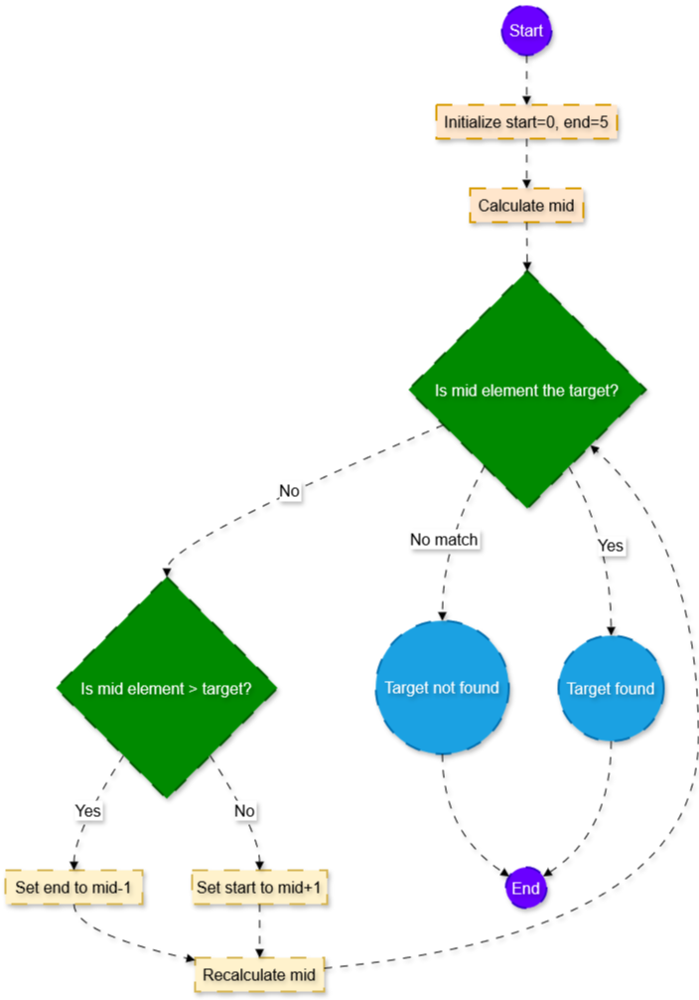

# Binary Search Algorithm

## Flow Chart

## Pseudo Code

1. Initialize variables `start`, `end`, and `index`:
   - `start` = 0
   - `end` = length of array - 1
   - `index` = -1

2. While `start` is less than or equal to `end`:
   - Calculate `mid` = (start + end) / 2

   - If the middle element `array[mid]` is equal to `target`:
     - Set `index` to `mid`
     - Break the loop

   - Else if `array[mid]` is less than `target`:
     - Set `start` to `mid + 1`

   - Else:
     - Set `end` to `mid - 1`

3. If `index` is not -1:
   - Print the target and its index

4. Else:
   - Print that the target is not found

## Time and Space Complexity

- **Time Complexity:**
  - The time complexity of the binary search algorithm is **O(log n)**. This is because with each iteration, the search space is halved until the target is found or the search space is exhausted.

- **Space Complexity:**
  - The space complexity of the binary search algorithm is **O(1)**. This is because the algorithm only uses a constant amount of extra space, regardless of the size of the input array.

## Explanation

Binary search is an efficient algorithm for finding an element in a sorted array. The algorithm works by repeatedly dividing the search interval in half. If the value of the search key is less than the item in the middle of the interval, the search focuses on the lower half. Otherwise, it focuses on the upper half. This process continues until the search interval is empty or the target value is found.

### Example
Given a sorted array `[1, 3, 5, 7, 9, 11]` and a target value `7`:

1. Start with `start` = 0 and `end` = 5.
2. Calculate `mid` = (0 + 5) / 2 = 2. The middle element is `5`.
3. Since `5` < `7`, update `start` = 3.
4. Calculate `mid` = (3 + 5) / 2 = 4. The middle element is `9`.
5. Since `9` > `7`, update `end` = 3.
6. Calculate `mid` = (3 + 3) / 2 = 3. The middle element is `7`.
7. Since `7` == `7`, the target is found at index `3`.

The algorithm efficiently narrows down the search space, leading to a fast and effective search process.
