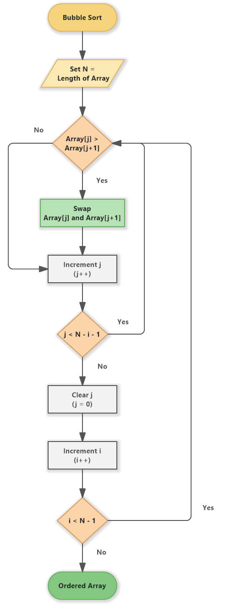
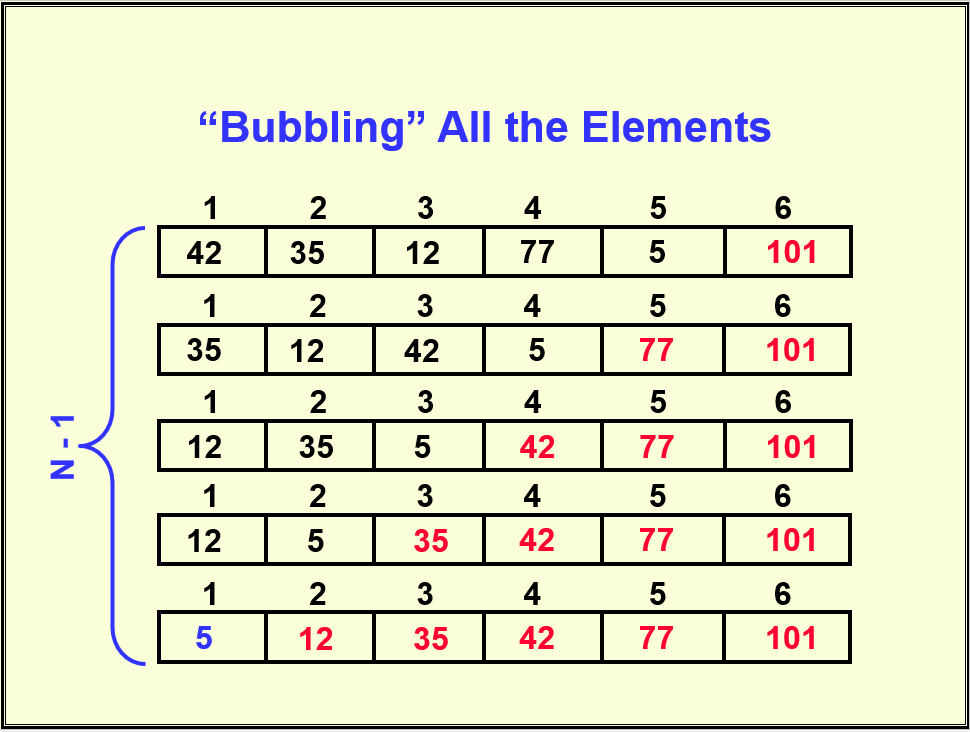

# **Bubble Sort Algorithm**

## Flowchart

## Algorithm Working

## Bubble Sort Algorithm

1. Start
2. Set i to 0
3. Iterate while i < size - 1
    1. Set j to 0
    2. Iterate while j < size - i - 1
        1. If array[j] > array[j + 1], then
            1. Swap array[j] and array[j + 1]
        2. Increment j by 1
    3. Increment i by 1
4. Stop
**Note:** we can use any loop while or for.

## Explanation

Bubble sort is a simple sorting algorithm that repeatedly steps through the list, compares adjacent elements, and swaps them if they are in the wrong order. The pass through the list is repeated until the list is sorted.

## Time and Space Complexity

- **Time Complexity**:
  - **Best Case**: \( O(n) \) - This occurs when the array is already sorted. In this case, bubble sort can detect the sorted array and terminate early after a single pass.
  - **Average Case**: \( O(n^2) \) - This occurs because, on average, bubble sort requires \( n/2 \) comparisons per pass and there are \( n \) passes, resulting in quadratic time complexity.
  - **Worst Case**: \( O(n^2) \) - This occurs when the array is sorted in reverse order, requiring the maximum number of comparisons and swaps.

- **Space Complexity**: \( O(1) \) - Bubble sort is an in-place sorting algorithm, meaning it requires a constant amount of additional space regardless of the input size. The only extra space used is for a few variables to perform the swaps.

## Example

Consider the array `arr = [5, 1, 4, 2, 8]`. Here's how Bubble Sort sorts this array:

1. **Initial Array**: `[5, 1, 4, 2, 8]`
   
2. **First Pass**:
   - Compare `5` and `1`, swap because `5 > 1`: `[1, 5, 4, 2, 8]`
   - Compare `5` and `4`, swap because `5 > 4`: `[1, 4, 5, 2, 8]`
   - Compare `5` and `2`, swap because `5 > 2`: `[1, 4, 2, 5, 8]`
   - Compare `5` and `8`, no swap: `[1, 4, 2, 5, 8]`

3. **Second Pass**:
   - Compare `1` and `4`, no swap: `[1, 4, 2, 5, 8]`
   - Compare `4` and `2`, swap because `4 > 2`: `[1, 2, 4, 5, 8]`
   - Compare `4` and `5`, no swap: `[1, 2, 4, 5, 8]`
   - Compare `5` and `8`, no swap: `[1, 2, 4, 5, 8]`

4. **Third Pass**:
   - Compare `1` and `2`, no swap: `[1, 2, 4, 5, 8]`
   - Compare `2` and `4`, no swap: `[1, 2, 4, 5, 8]`
   - Compare `4` and `5`, no swap: `[1, 2, 4, 5, 8]`
   - Compare `5` and `8`, no swap: `[1, 2, 4, 5, 8]`

5. **Sorted Array**: `[1, 2, 4, 5, 8]`
