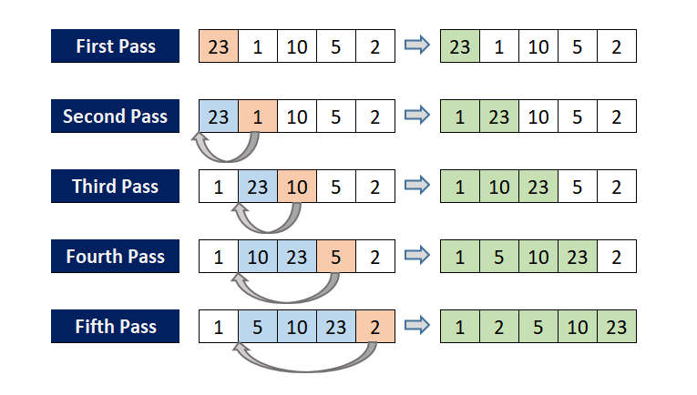

# **Insertion Sort Algorithm**

## Flowchart

## Algorithm Working

## Insertion Sort Algorithm

1. Start from the first element (index 0) of the array.
2. Set the current element as `currentValue`.
3. Initialize a variable `j` to the index of the previous element (i.e., `j = i - 1`).
4. While `j` is greater than or equal to 0 and the element at `j` is greater than `currentValue`:
   - Move the element at `j` one position to the right (i.e., `array[j + 1] = array[j]`).
   - Decrement `j` by 1.
5. Place the `currentValue` in its correct position (i.e., `array[j + 1] = currentValue`).
6. Repeat steps 2-5 for all elements in the array until the entire array is sorted.

## Time and Space Complexity

- **Time Complexity**:
  - **Best Case**: O(n) - This occurs when the array is already sorted. The inner loop only runs once for each element.
  - **Average Case**: O(n²) - This occurs for an average input. Each element may have to be compared with about half of the already sorted elements.
  - **Worst Case**: O(n²) - This occurs when the array is sorted in reverse order, requiring the maximum number of comparisons and shifts.

- **Space Complexity**: O(1) - Insertion Sort is an in-place sorting algorithm, which means it requires a constant amount of additional space regardless of the input size.

## Explanation of Insertion Sort

Insertion Sort is a simple sorting algorithm that builds the final sorted array (or list) one item at a time. It is much like sorting playing cards in your hands, where you gradually build up the sorted portion of the cards.
