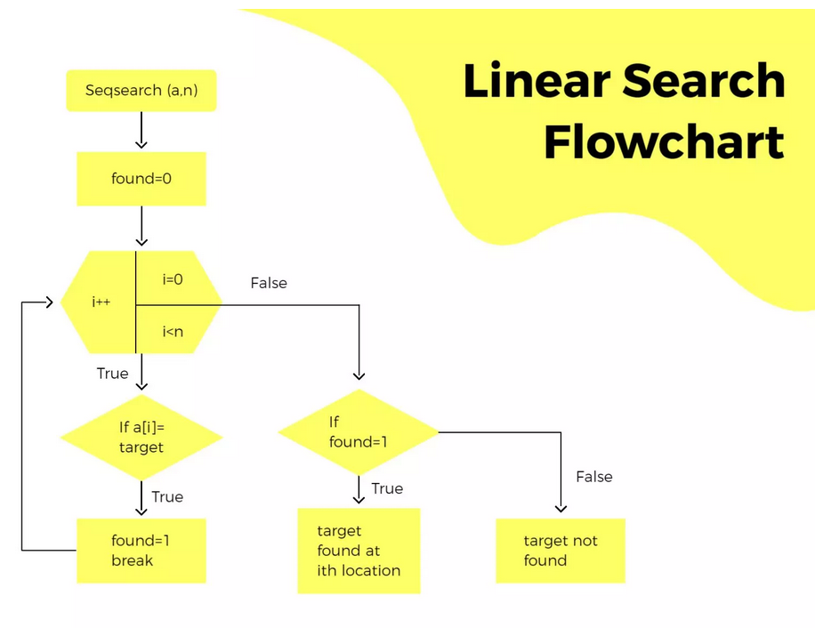

# Linear Search Algorithm

## Flowchart

## Pseudocode for Linear Search
1. Start
2. Initialize `index` to -1
3. Loop through each element of the array from `i = 0` to `i < size`
   - If `array[i]` equals the `target`
     - Set `index` to `i`
     - Break the loop
4. If `index` is not -1
   - Print "Element found at index: `index`"
5. Else
   - Print "Element not found in the array"
6. End

## Time and Space Complexity

### Time Complexity
The time complexity of the linear search algorithm is **O(n)**, where **n** is the number of elements in the array. This is because in the worst-case scenario, the algorithm will have to compare the target element with all elements in the array.

### Space Complexity
The space complexity of the linear search algorithm is **O(1)**. This is because the algorithm only uses a constant amount of extra space, regardless of the size of the input array.

## Explanation
Linear search is a simple search algorithm that checks each element in an array sequentially until the target element is found or the end of the array is reached. This algorithm is straightforward and works well for small or unsorted datasets. However, its efficiency decreases as the size of the dataset increases, making it less suitable for large datasets compared to more advanced search algorithms like binary search.
