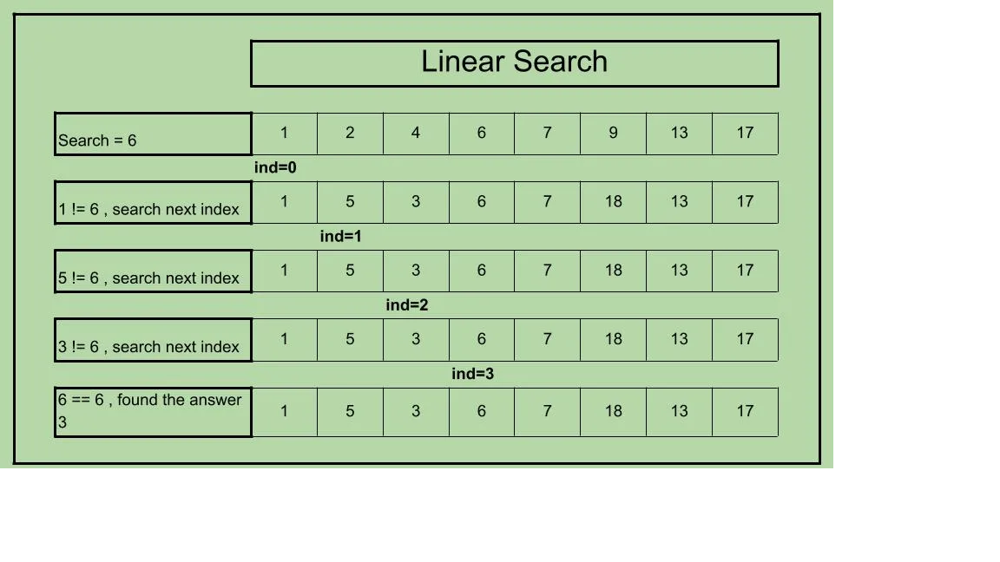

# **Linear Search Algorithm**

## Flowchart

## Algorithm Working

## Linear Search Algorithm
1. Start
2. Initialize `index` to -1
3. Loop through each element of the array from `i = 0` to `i < size`
   - If `array[i]` equals the `target`
     - Set `index` to `i`
     - Break the loop
4. If `index` is not -1
   - Print "Element found at index: `index`"
5. Else
   - Print "Element not found in the array"
6. End

Sure, here is the time and space complexity for the linear search algorithm written in the requested style:

## Time and Space Complexity

- **Time Complexity**:
  - **Best Case**: O(1) - This occurs when the target element is the first element in the array. Only one comparison is needed.
  - **Average Case**: O(n) - This occurs for an average input. The target element may be anywhere in the array, so it requires comparisons with approximately half of the elements.
  - **Worst Case**: O(n) - This occurs when the target element is the last element in the array or is not present at all, requiring comparisons with all elements.

- **Space Complexity**: O(1) - Linear search only uses a constant amount of additional space, regardless of the size of the input array.

  -  **Concept:** When we say the space complexity is ***O(1)***, we are referring to the additional memory that the algorithm needs to execute, aside from the memory used by the input itself.

## Explanation
Linear search is a simple search algorithm that checks each element in an array sequentially until the target element is found or the end of the array is reached. This algorithm is straightforward and works well for small or unsorted datasets. However, its efficiency decreases as the size of the dataset increases, making it less suitable for large datasets compared to more advanced search algorithms like binary search.
