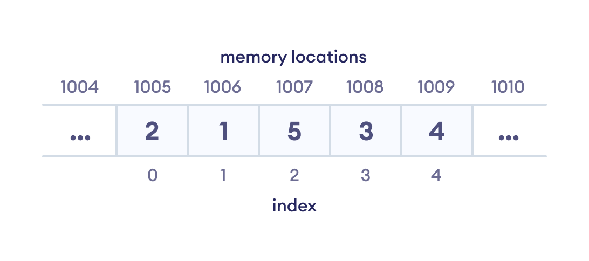

# **Data Structure and Types**
## **What are Data Structures?**
Data structure is a storage that is used to store and organize data. It is a way of arranging data on a computer so that it can be accessed and updated efficiently.

Depending on your requirement and project, it is important to choose the right data structure for your project. For example, if you want to store data sequentially in the memory, then you can go for the Array data structure.

Note: Data structure and data types are slightly different. Data structure is the collection of data types arranged in a specific order.

DSA Tutorials

    Tree Data Structure
    Graph Data Stucture
    Linked list Data Structure
    Stack Data Structure
    Queue Data Structure
    Tree Traversal - inorder, preorder and postorder

Data Structure and Types
What are Data Structures?

Data structure is a storage that is used to store and organize data. It is a way of arranging data on a computer so that it can be accessed and updated efficiently.

Depending on your requirement and project, it is important to choose the right data structure for your project. For example, if you want to store data sequentially in the memory, then you can go for the Array data structure.
Storing data sequentially in the array data structure
Array data Structure Representation

Note: Data structure and data types are slightly different. Data structure is the collection of data types arranged in a specific order.

## **Types of Data Structure**
Basically, data structures are divided into two categories:
    * Linear data structure
    * Non-linear data structure

Let's learn about each type in detail.

## **Linear data structures**

In linear data structures, the elements are arranged in sequence one after the other. Since elements are arranged in particular order, they are easy to implement.

However, when the complexity of the program increases, the linear data structures might not be the best choice because of operational complexities.

**Popular linear data structures are:**
## **1. Array Data Structure**
In an array, elements in memory are arranged in continuous memory. All the elements of an array are of the same type. And, the type of elements that can be stored in the form of arrays is determined by the programming language.
.png)

//---------------
