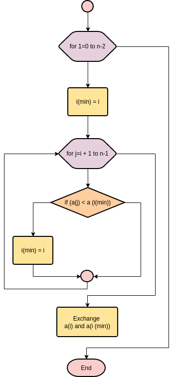

# **Selection Sort Algorithm**
Selection sort is a sorting algorithm that selects the smallest element from an unsorted list in each iteration and places that element at the beginning of the unsorted list.

## **Working of Selection Sort**
1. Set the first element as `minimum`.

.png) 

2. Compare `minimum` with the second element. If the second element is smaller than `minimum`, assign the second element as `minimum`.

   Compare `minimum` with the third element. Again, if the third element is smaller, then assign `minimum` to the third element otherwise do nothing. The process goes on until the last element. 

.png)

3. After each iteration, `minimum` is placed in the front of the unsorted list. 

.png)

4. For each iteration, indexing starts from the first unsorted element. Step 1 to 3 are repeated until all the elements are placed at their correct positions. 

.png)

.png)

.png)

.png)

## Flowchart

## Algorithm Working

## Selection Sort Algorithm
1. Start with the first element of the array as the minimum (minIndex).
2. Set i to 0.
3. Repeat until i is less than the size of the array minus 1:
   1. Set minIndex to i.
   2. Initialize j to i + 1.
   3. While j is less than the size of the array:
      1. If the element at j is less than the element at minIndex, then:
         1. Update minIndex to j.
      2. Increment j by 1.
   4. If minIndex is not equal to i, then:
      1. Swap the elements at i and minIndex.
   5. Increment i by 1.
4. Repeat steps 2-5 until the entire array is sorted.
5. Stop.

## Time and Space Complexity

| Complexity      | Best Case | Average Case | Worst Case |
|-----------------|-----------|--------------|------------|
| **Time**        | \( O(n^2) \) | \( O(n^2) \) | \( O(n^2) \) |
| **Description** | This occurs when the array is already sorted. Each element must still be compared with every other element. | This occurs for an average input. Each element may require comparisons with almost all other elements. | This occurs when the array is sorted in reverse order, requiring the maximum number of comparisons. |
| **Space**       | \( O(1) \) | \( O(1) \)   | \( O(1) \)  |
| **Description** | Selection Sort is an in-place sorting algorithm, meaning it requires a constant amount of additional space regardless of the input size. | Selection Sort is an in-place sorting algorithm, meaning it requires a constant amount of additional space regardless of the input size. | Selection Sort is an in-place sorting algorithm, meaning it requires a constant amount of additional space regardless of the input size. |

### Explanation of Selection Sort

Selection Sort is a simple comparison-based sorting algorithm. Here’s how it works:

1. **Initialization**: The algorithm divides the array into two parts: the sorted part and the unsorted part. Initially, the sorted part is empty, and the unsorted part contains the entire array.

2. **Finding the Minimum**:
   - Start from the beginning of the unsorted part and assume the first element is the minimum.
   - Compare this minimum with the other elements in the unsorted part to find the true minimum.

3. **Swapping**:
   - Once the minimum element is found, swap it with the first element of the unsorted part. This effectively grows the sorted part of the array.

4. **Repeat**:
   - Move the boundary between the sorted and unsorted parts one element to the right and repeat the process until the entire array is sorted.

### Example

Consider the array: `[64, 25, 12, 22, 11]`

1. **First Pass**:
   - Minimum is `11`. Swap with `64`.
   - Array: `[11, 25, 12, 22, 64]`

2. **Second Pass**:
   - Minimum is `12`. Swap with `25`.
   - Array: `[11, 12, 25, 22, 64]`

3. **Third Pass**:
   - Minimum is `22`. Swap with `25`.
   - Array: `[11, 12, 22, 25, 64]`

4. **Fourth Pass**:
   - Minimum is `25` (no change needed).
   - Array: `[11, 12, 22, 25, 64]`

### Characteristics
- **Stability**: Selection Sort is not a stable sort; equal elements may not retain their original order Where as **Bubble and insertion sort is stable sort algorithms**.
- **In-Place**: It requires only a constant amount of additional space, making it an in-place sorting algorithm.

### Use Cases
Selection Sort is not the most efficient algorithm for large datasets but can be useful for small arrays or as part of more complex algorithms.